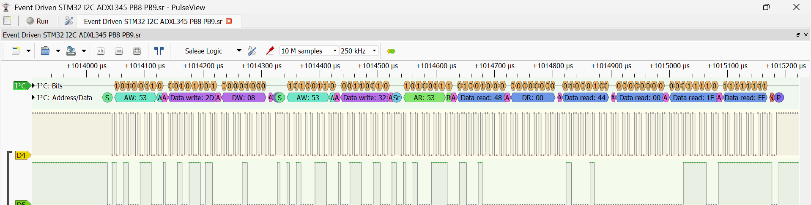

# STM32F411 Bare-Metal ADXL345 I2C Driver

A register-level implementation of an I2C Master driver for the ADXL345 accelerometer for the STM32F411CEU6. 

Polling driver can be found [here](https://github.com/Abi-Hurairah/STM32_I2C_ADXL345), while the event-driven driver is in progress [here](https://github.com/Abi-Hurairah/STM32_I2C_ADXL345/tree/feature/i2c-interrupt-logic).

## Hardware Configuration

This firmware is configured to use **I2C1**:
* **PB8** -> SCL 
* **PB9** -> SDA

NOTE: PB6 and PB7 were previously used, however it suffered electrical damage due to lack of grounding. It is now reconfigured to use PB8 and PB9 instead, but can reconfigured back if desired in your board.

## Technical Specifications
- **Hardware:** STM32F411CEU6 "Black Pill"
- **Peripheral:** I2C1
- **Clock Speed:** 16 MHz HSI (Internal High Speed)
- **I2C Mode:** Standard Mode (100 kHz)
- **Timing Calculations:**
  - `CCR = 16MHz / (2 * 100kHz) = 80`
  - `TRISE = (1000ns / 62.5ns) + 1 = 17`

## Features
- **Zero-Abstraction:** No HAL or LL drivers used for the I2C transaction.
- **Burst Read:** Immediate 6-byte read for X, Y, and Z axes to prevent data tearing.
- **Timeout Logic:** SysTick-based error handling via software reset when the STM32 freezes or hangs during communication (event-driven) or via timeouts (polling). 
- **Modular Driver Design:** Decoupled hardware logic from main.c using adxl345.h/c interface.
- **Event-Driven:** Leaves the CPU free to potentially execute other tasks by utilizing interrupts.
- [PLANNED] **Power Saving (Event-Driven):** CPU sleeps inbetween byte reads to reduce power consumption.
- [PLANNED] **DMA (Event-Driven):** Sending bytes to DMA controller to achieve even higher energy efficiency.

## Quirks
With the polling driver, the stop condition is activated between the reading of the 4th and 5th byte of a measurement. By the time the 6th byte arrives, the sensor will correctly stop sending data. 

In the event-driven driver, the stop condition was also activated with the same timing. However, it is discovered that doing so will end the read prematurely by the 5th byte. As a result, the stop condition is set to be in between the reading of the 5th and 6th byte.

## Error Handling 
**Polling:** SysTick-based timeout on blocking flag checks (e.g., ADDR, SB, BTF) that aborts and returns an error code if the bus deadlocks.

**Event-Driven:** Before the STM32 starts doing a single read, a SysTick timer limits the execution for a single read to be within 500 miliseconds. If there is a timeout, an error handling ISR will execute a peripheral software reset. Otherwise, the timer will be reset for the next read.

## Repository Structure
- `/Core`: Main application logic and register configurations.
- `/Drivers/CMSIS`: Hardware register definitions.
- `/Docs`: Documentation regarding the project.
- `*.ioc`: STM32CubeMX configuration file.

## Protocol Verification

The waveform below illustrates a successful I2C transaction between the STM32 and the ADXL345:

*The raw digital capture session file can be found in `./Docs` and viewed directly in PulseView.*